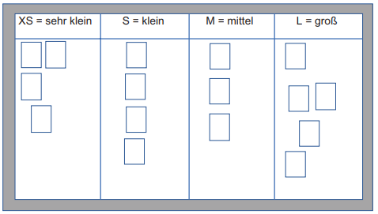

class: center, middle

## [Software Projektmanagement](index.html)

#### Kapitel 11
**Priorisieren - Was ist wie Wichtig ?**

---
#### Einführung

Priorisierung und seine Wichtigkeit:
- In der verüfgbaren Zeit, Nutzen und Wert maximieren
- Entscheidende Kriterien die beim Priorisieren beachtet werden sollten
- Die Frage welche Aufgaben oder Funktionen zuerst umgesetzt werden sollten, um dieses Ziel zu erreichen, sind hier ausschlaggebend.

Eine gut durchdachte Priorisierung, ist daher ein Schlüssaspekt agiler Projekte

---
#### Einflüsse auf die Priorisierung im Product Backlog

- Der Nutzen oder Geschäftswert eines Items

- Die Relevanz aus Kundensicht: Welche Bedeutung hat die Erfüllung, aus der Sicht des Kunden ?

- Risiken: Welche Risiken sind mit der Erledigung verbunden ?

- Cost of Delay: Welche Verzögerungskosten können anfallen, wenn etwas erst später umgesetzt wird ?

- Abhängigkeiten: Idealerweise sind die Items unabhängig voneinander.
    Wenn Abhängigkeiten bestehen gibt das Item die Sortierung vor, welches die Voraussetzung für das andere Item darstellt.

---

#### Risiko und Wert
*Matrixdarstellung:*

- Anforderungen / Items: A1-A9
- Y-Achse: Risiko
- X-Achse: Geschäftswert / Nutzen

---
#### Unterscheidung zwischen Komplexität und Aufwand

In agilen Projekten wird nicht der Aufwand geschätzt, sondern die Komplexität.
Diese Einschätzung hat den Vorteil: 
-  Vergleichen ist einfacher als konkrete Werte zu nennen
-  Die komplexität ändert sich nicht, nur die Zeit

Die Einschätzung erfolgt sinnvollerweise von dem Team, die die To-dos umsetzen wird.

---

#### Beginn der Priorisierung

In agilen Projekten findet bereits bei der Planung eine erste Priorisierung statt und eine sich kontinuierlich wiederholende: 

- wenn die Notwendigkeit für bzw. gegen die Umsetzung, durch neue Erkenntnisse, nicht mehr nötig ist.
- aufgrund von Feedback des Teams oder des Kunden
- wenn neue Items eine höhere Priorisierung haben
  
---

#### Priorisieren nach Einschätzung der Komplexität 11.3

Schätzen mit T-Shirt Größen:

Die To-dos/Anforderungen werden in Gruppen eingeteilt, die jeweils eine ähnliche Komplexität aufweisen.

Beispiel Gruppierung:
- S = wenig komplex
- M = mittlere Komplexität
- L = große Komplexität
- XL = sehr große Komplexität.

Feinere Gruppierungen können bei Notwendigkeit ergänzt werden, z. B. XS, XXL, usw.

Vorraussetzung: Referenzstory d.h es wird versucht, die Komplexität anhand bereits erledigter To-dos einzuschätzen.

---

**Abbildung T-Shirt Größen:**

---

#### Priorisieren nach Einschätzung des Wertes 11.4

Einfaches Priorisieren ist ein sehr pragmatischer Ansatz:
- Vergabe von Prioritätsstufen
- Priorität 1,2,3 oder A,B,C

Die Stufen können je nach Bedarf interpretiert werden. (Nach: Aufwand, Nutzen, eine Kombination aus dessen)

Problematik: Wenn zu viele Anforderungen die höchste Priorität haben, verlieren die Stufen an Aussagekraft und die Einschätzung fällt deutlich schwerer. 

Lösung: Verfeinerung der Stufen durch z.B MuSCoW

---

**MuSCoW:**

Dort sind die Stufen Akronyme, d.h sie werden aus Abkürzungen des Wortes Muscow beschrieben:

Mu = Must have - dringend Notwendig:
Ohne die Umsetzung der Anforderungen, wird das Produkt nicht funktionieren oder hat keinen Wert.

S = Should have - erfoderlich:
To-dos sollten also umgesezt werden/ vorhanden sein.

Co = Could have - können vorhanden sein:
Die Umsetzung hat Vorteile, sind aber nicht so dringend und erfolgskritisch.

W = Would like to have - ausgeschlossen:
Niedrigste Priorität, sind notiert haben aber geringe Chance auf Umsetzung.

MuSCoW versucht den Wert einer Anfoderung stärker zu beleuchten.

---

**Zusammenfassung:**

Wesentliche der Priorisierung
- Einflüsse auf die Reihenfolge nach:
1. Geschäftswert
2. Kundennutzen
3. Komplexität/Aufwand und Kosten der Umsetzung
4. Verbundene Risiken

Einfache Einteilung von To-dos, ist über MoSCoW möglich.
