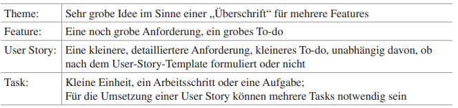
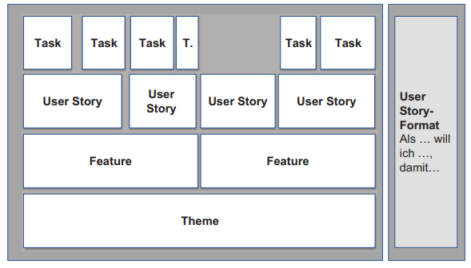
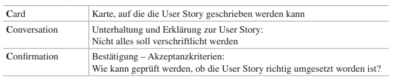

class: center, middle

## [Software Projektmanagement](index.html)

#### Kapitel 12
**To-dos mit unterschiedlicher Feinheit:**

---

**Hierarchie der To-dos in unterschiedlicher Ausprägung:**

*Begriffsklärung:*

---

**Zeitlicher Horizont 12.1**

Der zeitliche Horizont hängt mit dem Detaillierungsgrad der Anforderungen zusammen.

Beginnend bei noch groben To-dos = Themes.
Diese werden irgendwann zu Features verkleinert.
Diese Features werden zu User Stories.
User Stories werden zu Tasks.

---

**Warum gibt es die Hierarchie: ?**
- Um die Verschwendung von Ressourcen zu vermeiden (Arbeit)
- Betrachtung von nur hoch priorisierten To-dos, die unterteilt werden
- Klein priorisierte bleiben im Product Backlog vermekt, werden nur nicht weiter betrachtet

Wichtig:
- richtiges Gleichgewicht zwischen Zeit und Detaillierungsgrad
- Zu viele Details der To-dos, kann verzögerungen verursachen,
- Zu wenig, kann die Qualität und die Fähigkeit zur Planung beeinträchtigen

Entschluss:
- Team sollte flexibel sein, den Detaillierungsgrad der Anforderungen und den zeitlichen Horizont, basierend auf den Anforderungen des Projekts und dem Kundenfeedback, anpassen.

---

**User Stories: Formulieren und bezeichnen 12.2**

**Formulierung über eine User Story Schablone:**
- Als --Rolle-- 
- will ich --Funktionalität--
- damit --Begründung--

1. Rolle: Kann Kunden, Stakeholder sein
2. Funktionalität: Beschreibung
3. Begründung: Warum brauche ich das.

Einfaches Beispiel: 
1. Als: Kunde
2. will ich: einen Warenkorb haben, wo ich meine Produkte hinzufügen kann
3. damit: ich einen Überblick über alle hinzugefügten Produkte habe.

=> Knappe Beschreibung der Funktionalität

---

**Die 3C der User Stories**

Beim Formulieren von User Stories sollte das Prinzip der "3C" beachtet werden:

- Card: Notierung der User Story auf Karten
- Conversation: 
    - Das Team kommuniziert und folgt nicht nur blind dem, was zugrundegelgt wurde. 
    - Sicherstellung der Absichten durch klare Kommunikation und aktive Nachfrage.
    - Vermeidet Missverständnisse und das aufkommen unzureichenden Verständnisses der Anforderungen
- Confirmation:
    - Akzeptanzkriterien festlegen, ab wann eine Aufgabe oder User Story in einem Projekt, als abgeschlossen gilt.

*Akzeptanzkriterium zum vorherigen Beispiel:*
Jedes Produkt wird im Warenkorb, eindeutig mit Namen, Preis und Verfügbarkeit angezeigt. (Produkte können jegliche Art sein, Software,...)

---

**Ansätze zum Splitten von User Stories**
- Splitten nach Workflow:
  - Unterteilung von User Stories auf verschiedene Schritte im Workflow
  - Jeder Schritt im Workflow kann als eine separate Story betrachtet werden
  - Problematik: Zwangsläufige Abhängigkeiten zwischen den User Stories, durch die bestimmte Reihenfolge des Workflows

- Splitten nach Aufwand:
    - Teilung nach geschätztem Aufwand für die Umsetzung
    - Das kann bedeuten: Einfache Teile zuerst entwickeln

- Variation in den Daten:
  - Anforderungen für verschieden Dateneingaben oder Sprachen variieren
  - User Stories entsprechend der Variation aufgeteilt werden

Das Ziel vom Splitten ist, kleine, unabhängige, gut testbare User Stories zu erhalten, mit den INVEST-Eigenschaften.

---

**Das Ergebnis:**

- Eine Story Map als Roadmap, die eine Übersicht darstellt.
- Product Backlog mit Priorisierten User Stories
