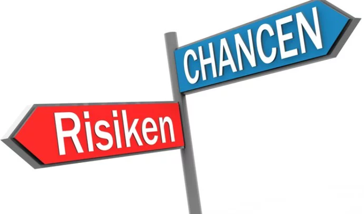
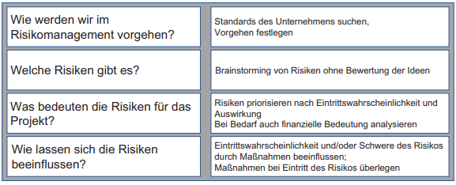

class: center, middle

## [Software Projektmanagement](index.html)

#### Kapitel 13
**Risiken & Nebenwirkungen**

---
#### Risiken und Nebenwirkungen

**Einführung:**

In diesem Kapitel betrachten wir: 

- Prozesse des Risikomanagemnts
- Risikoarten
- Techniken wie Risiken identifiziert werden können: Ausblick auf "Sailboat" oder Ursache-Risiko-Tabellen.
- Qualifizieren und Quantifizieren von Risiken
- Risikobewältigung

---

**Begriff Risiken im Kontext von agilen Projekten:**

- Sind unvorhersehbare Ereignisse die sich entweder positiv oder negativ auf das Projekt auswirken.
- Risiken sind meist negativ ausgelgt, die Störungen oder Gefahren für ein Projekt darstellen
- Ereignisse können aber auch positive Auswirkungen haben, die dann als Chancen verstanden werden

---

**Risikomanagment in agilen Projekten:**

- Versucht frühzeitig potenzielle Risiken und Chancen zu erkennen 

- Wichtig für die Einkalkulation in die Planung

- Kontinuierliche Überprüfung und Anpassung auch während des Projektverlaufs

- Ermöglicht eine proaktive Herangehenswiese, um mit unvorhersehbaren 
  Ereignissen umzugehen

- Negative Auswirkungen minimiert, gleichzeitig Chancen realisiert

---

**Planungsschritte im Risikomanagement:**

 

---

**Welche Risiken gibt es ?**

Risikoarten:
- Risiken die durch Ereignisse ausgelöst werden
    - Technische Störung: z.B ein Serverabsturz, Netwerkauslastung

- Immanente Risiken die unabhängig von Ereignissen auftreten
    - Die Veränderung von Marktgegebenheiten: z.B Nachfrage der Produkte
    oder allgemein eine steigende Inflation

---

**Techniken zur Identifizierung von Risiken**

**"Sailboat" Technik:**

Das Softwareprojekt ist eine Reise von A nach B auf dem Meer, mit einem Segelschiff.

**Folgende Fragen sollten diskutiert werden:**

Was kann unterwegs passieren ?
Wo und Wann kann Gegenwind auftreten? Gefährliche Riffe oder Felsen? Ungünstige Strömung? Probleme bei der Besatzung ?

- Das sind die negativen Riskien oder Bedrohungen die auftreten können und es zu identifizieren gilt

Was kann die Reise vorantreiben ? Leichter gestalten? Wo und Wann gibt es Rückenwind ? Hilfreiche Strömung? Teamarbeit der Besatzung ?

- Das sind die positiven Risiken, auch Chancen gennant, die frühzeitig realisiert werden sollen

---

**Ursache-Riskio-Tabelle in IT-Projekten:**

| Ursache für Risiken  | Risiko   |
| -------- | -------- |
| Magelnde Expertise    | Gefährdung des reibungslosen Ablaufs der Entwicklung  |
| Knappe Ressourcen   | Budgetüberschreitung   |
| Änderung in den Anfoderungen | Produkt entspricht nicht den Kundenwünschen |
|...|...|

**Ziel der Tabelle:**
- Unvorhersehbare Dinge im Projekt zu ermitteln um anschließend agieren und priorisieren zu können, wie man weiter mit ihnen verfährt.

---

**Bewertung der Risiken: Qualifizierung/Quantifizierung**

**Qualifizierung:**

- Der erste Schritt versucht eine Einschätzung über das eintreten und dessen Auswirkung von Risiken zu teffen, dafür müssen alle Beteiligten Verständnis über die Einstufungen haben.

- Was bedeutet eine mittlere Eintrittswahrscheinlichkeit ?
- Was bedeutet geringe Auswirkung ?

Diese Fragenkombination lässt sich in einer  Probability-Impact Matrix (Wahrscheinlichkeits-Auswirkungsmatrix) darstellen.

Die Einordnung der Risiken erfolgt im Team, der Austausch und die Diskussion.

---

**Darstellung einer Probability-Impact Matrix**

- X-Achse: Auswirkung (Impact)
- Y-Achse: Wahrscheinlichkeit (Probability)
- R1-R9: Risiken

---

**Quantifizierung:**

Über Bewertung in Euro:
Bei dieser Methode werden Risiken ein Geldbetrag (in Euro) zugeordnet, der sich aus folgender Berechnung ergibt.

*Eintrittswahrscheinlichkeit in % X mit der Auswirkung bei Eintreten des Risikos (in Euro)*

Folgende Punkte lassen sich daraus abschätzen:
- Wie groß die finanzielle Reserve sein muss
- Welche Auswirkung die gewählte Risk Response (Risikobewältigungsmaßnahme) haben wird und ob sie ihren Zweck erfüllt.

---

**Umgang mit Risiken:**

Strategien bei Risk Responses (Risikobewältigungsmaßnahmen)
- Eskalieren: Gefahr/Chance liegt außerhalb des Einflussbereichs des Projekts
    => Weiterleitung an höhre Instanzen die Maßnahmen ergreifen können
- Vermeiden von Bedrohungen, Nutzen von Chancen:
  -  Schwerwiegende negative Risiken => Ziele/Projektumfang wird eingegrenzt
  - Nutzung von Chancen => Maßnahmen ergreifen, um Eintrittswahrscheinlichkeiten zu maximieren z.B durch der Einsatz der besten verfügbaren Ressourcen oder eine neuen Priorisierung
- Akzeptieren: Erkennung des Risikos, aber keine speziellen Maßnahmen. Der Grund:
    - Unbedeutendes Risiko
    - Keine sinnvolle Reaktion möglich
    - Problem: Aus Risiken können Risiken entstehen

---

**Auswirkung der Risk Responses auf das Product Backlog:**

- Basierend auf den identifizierten Risiken und den Manßnahmen zur Bewältigung, können nun Anpassungen am Product Backlog vorgenommen werden.
  - Gibt es neue User-Stories?
  
  - Erfolgt dadurch eine neue Priorität ?
  
  - Fallen bestehende Features oder User-Stories weg?

---

**Kurze Zusammenfassung:**

- Risikomanagement in agilen projekte (Anpassungsfähig & Flexibel)
- Planungsschritte im Risikomanagement
- Risikoarten: Ereignisbasierte Risiken & immenente Risiken
- Techniken zur Identifizierung von Risiken (Sailboat & Ursache-Risiko Tabelle)
- Qualifizierung und Quantifizierung von Risiken
- Umgang mit Risiken (Eskalieren, Vermeiden,...)
- Auswirkung der Risk Responses auf den Product Backlog
