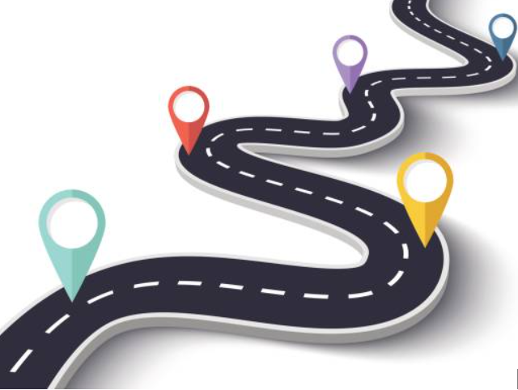
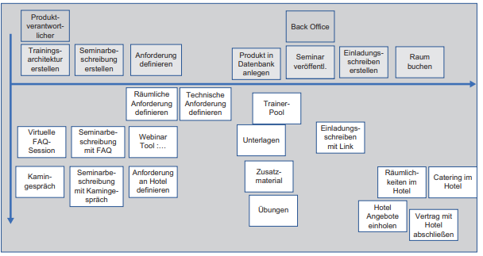
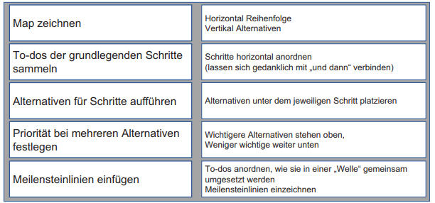

class: center, middle

## [Software Projektmanagement](index.html)

#### Kapitel 15
**Die Roadmap**

---

### 15. Roadmap - Zuordnung der To-dos zu den Stücken

**Einführung:**

Eine Roadmap zeigt die zeitliche Reihenfolge der konkreten Umsetzungen der To-dos, aus dem Product Backlog. Als Tool dafür, gibt es das "Story-Mapping", im Grunde eine visuelle Darstellung der Aufgaben.
Das "Mapping" ist kein Ersatz für den Product Backlog, sondern schafft einen Überblick über das Produkt.

---

**Grundlegender Aufbau einer Storymap:**

- X-Achse zeigt die Reihenfolge der To-dos
- Y-Achse die Alternativen bzw. Ergänzungen und Erweiterungen, die nach Priorität sortiert sind

---

**Auschnitt aus einer Storymap am konkreten Beispiel:**

- Reihenfolge der Umsetzung ist horizontal angeordnet
- Wer diese Umsetzung durchführt, steht über dem Schritt
- Gibt es zwei-Teilschritt für einen Schritt, wird ein Oberbegriff bestimmt
- Alternative Schritte, werden vertikal unter dem jeweiligen Schritt angeordnet. Gleichzeitig werden sie durch ihre Anordnung priorisiert 
- Es kann gleichwertige Alternativen geben, die stehen in der Story Map nebeneinander (räumliche- und technische Anforderungen)

---

**Probleme der Story Map:**
- Die Reihenfolge der Schritte kann sich situativ ändern, auch kann es von anfang an mehrere Möglichkeiten geben.
- Es kann Schritte geben, die wiederholende Schritte anzeigen
- Es kann Teileaspekte geben, die keine Alternativen sind, sondern Ergänzungen die dazugehören

**Ziel der Storymap:**

- Nutzen liegt auf der Vorstellung der Schritte und der darstellung von Alternativen
- Sie soll ein Kommunikationsmittel sein, kein voll ausgearbeitetes System.

---
**15.2 Planung eines Produktes mit der Story Map**

**Anhand eines MVPs:**

Welche Anforderungen müssen zuerst erledigt werden um Erfahrung und Feedback zu sammeln?
- Diese To-dos werden horizontal angeordnet auf einer "Meilensteinlinie"
- Diese Meilensteinlinie bildet das erste Stück des Produkts

Fortlaufend können weitere Stücke ergänzt werden

---

**Überblick beim Erstellen der Story Map:**

---

**Tiefe einer Story Map:**

- Abhängig von der jeweiligen Expertise im Themenbereich.
  - Team eher unerfahren: grobe Ausarbeitung und besondes wichtig ist das einzuholende Feedback
  - Team sehr erfahren: detaillierte Ausarbeitung

**StoryMap und Productbacklog:**

- Beides sind Möglichkeiten, um To-dos aufzulisten.
- Die Storymap und das Product Backlog stehen nebeneinander, d.h sie ergänzen sich

---

**15.3 Umsetzung der Storymap ins Product Backlog**

Die Storymap zeigt den Überblick über die anstehende Arbeiten und die geplanten Stücke.

Zwei Möglichkeiten die To-dos in das Product Backlog zu überführen:
- Übertragung aller Einträge ins Product Backlog
- Übertragung der Einträge, die für den Meilenstein umgesetzt werden.
  1. Vorteil:
    - Kompakt: Nur das was notwendig ist wird übertragen
    - Anpassungen: Feedback kann Anpassungen herbeiführen, was kein Problem darstellt, weil nicht zuweit in die Zukunft geplant wurde

---

**Übergang Storymap, Product Backlog Grafisch dargestellt:**

---

**Kurze Zusammenfassung:**
- Einführung in Roadmaps und Storymap
- Planung eines Produkts anhand eines MVP, mithilfe der Storymap
- Übergang von Storymap in Product Backlog betrachtet 

