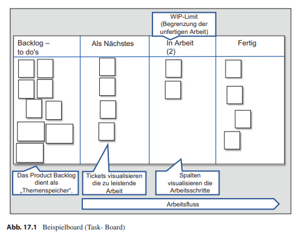
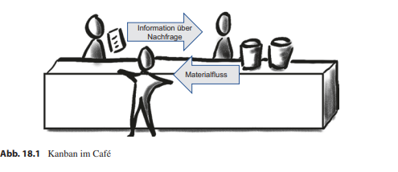
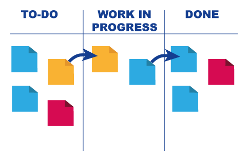
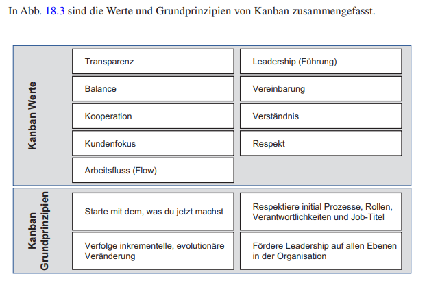

class: center, middle

## [Software Projektmanagement](index.html)

#### Kapitel 18

# Einführung in Kanban

---
## Was ist Kanban?
- Methode des visuellen Managements und der Prozessoptimierung
- Arbeitsfluss visualisieren
- Arbeitseinheiten als Karten dargestellt
- Arbeitsprozesse in Spaltenunterteilt

---
## Kanban Praktiken
 

1. Praktik: Mach die Arbeit sichtbar
   
2. Praktik: Limitiere den Work in Progress
   
3. Praktik: Manage Flow
   
4. Praktik: Mach Prozessregeln explizit
   
5. Praktik: Implementiere Feedbackmechanismen
   
6. Praktik: Führe gemeinschaftlich Verbesserungen durch

---
## Kanban in der Produktion
 

 
- Ein nachgelagerter Prozess sagt dem vorgelagerten, dass neue Teile benötigt werden.
- Es wird nur das produziert, was benötigt wird.
- Fehlerhafte Teile werden nicht weitergegeben.

---
class: center
## Kanban in der Wissenschaft

Bild: https://parm.com/projektmanagement-abc-k-wie-kanban/

---
## Die Werte, Grundprinzipien von Kanban

---