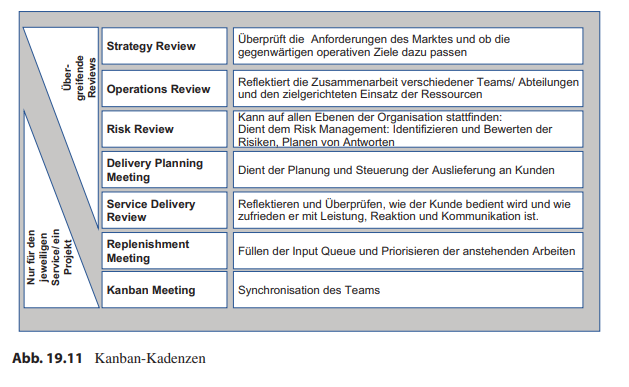

class: center, middle

## [Software Projektmanagement](index.html)

#### Kapitel 19

# Die Kanban-Praktiken und was sie für die Projektarbeit bedeuten

---
class: center
## Praktik: Mach Arbeit sichtbar

---
### Welche Arbeitstypen haben Sie?

---
### Welche Arbeitsschritte haben sie? Die Visualisierung des Prozesses

---
#### Swim Lanes

---
### Die Tickets

**Welche Informationen sollen die Ticket haben?**
- Ersteller
- Beschreibung der Arbeit
- Datum (Erstellung/Abgabe)

**Wie erkennt man, werd das Ticket bearbeitet?**
- Name
- Kürzel
- Foto, Avatar

**Zu welchem Arbeitstyp gehört das Ticket?**
- Farbe
- Form
- Kürzel

---
## Praktik: Limitiere den Work in Progress

---
### Little’s Law
 

Je kleiner die Menge paralleler Arbeitseinheiten (Work in Progress), desto schneller wird die Arbeit fertig.
---
class: center, middle
### Faustformel für WIP-Limits?

**Aktivitätsspalten:** 1-3 pro Teammitglied, das in den Prozessschritt involviert ist.

**Buffer-Spalten:** Wenn sie einmal täglich leer sind, ist das Limit zu niedrig.

---
## Praktik: Manage Flow

---
### Der Fluss im System

---
## Praktik: Mach Prozessregeln explizit
**Beispiele für Regeln:**
- Definition of Done
- Was sind die Serviceklassen und wie sehen ihre Tickets aus
- Bearbeitungsregeln für die Serviceklassen
- Kapazitäten der Serviceklassen
- Informationspflichten für Tickets
---

---
## Praktik: Implementiere Feedbackmechanismen

---
## Praktik: Führe gemeinschaftlich Verbesserungen durch

Die Retrospektive, ein Meeting, bei dem die Zusammenarbeit im Team, seine Prozesse, Kommunikation, Regeln usw. diskutiert werden, um gemeinsam für Verbesserungen zu sorgen. Dabei muss nicht immer ein Fehlschlag zum Anlass der Verbesserung sein.

Auch hier wichtig, in regelmäßigen Abständen(z.B. einmal im Monat)

Geschützte Raum:
- Wir sind tief überzeugt, – egal, was wir heute erkennen – dass alle Beteiligten zu jedem Zeitpunkt nach bestem Wissen, Gewissen und Kenntnisstand gehandelt haben“ von Norman L. Kerth
- Was im Raum gesagt wird, bleibt im Raum.
---
class: center
### Ablauf von Retrospektiven

