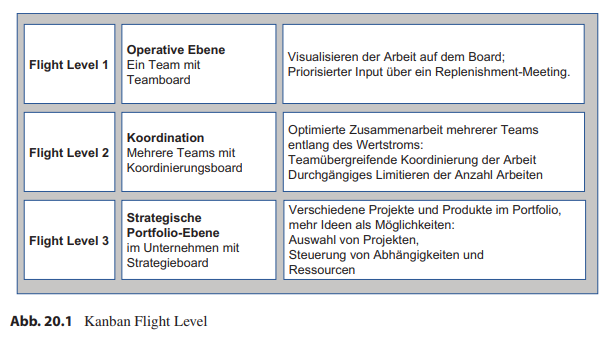
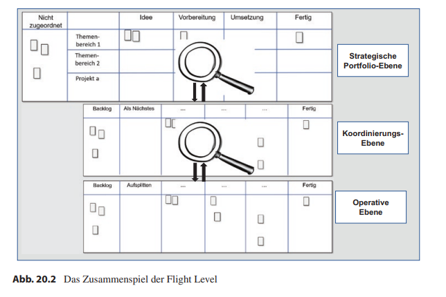

class: center, middle

## [Software Projektmanagement](index.html)

#### Kapitel 20

# Kanban auf verschiedenen Ebenen einsetzen – die Kanban Flight Level

---
class: middle
## Flight Level

Je höher das Flight Level, desto weniger Details sieht man, doch man bekommt einen besseren Überblick.
---
## Zusammenspiel der Flight Level

---

### Kurze Zusammenfassung Kanban
- Kanban kann von einzelnen Personen und Teams bis hin zu mehreren Teams oder auf Unternehmensebene genutzt werden.
- Ursprünglich in der Produktion genutzt, doch jetzt mehrfach in der Wissenschaft.
- Ein Kanban-Board ist „lebendig“, es wird immer von der IST-Situation erstellt und entwickelt und verbessert sich im Laufe der Zeit immer weiter.
- Der Mensch steht beim Kanban ganz vorne, weswegen man die Werte nach ganz oben stellt:
  - Transparenz
  - Balance
  - Kooperation
  - Kundenfokus
  - Arbeitsfluss
  - Führung
  - Verständnis
  - Vereinbarung
  - Respekt

---

- Damit ein Kanban-Board auch zu einem Kanban-Board und keinem Task-Board wird, sind die 6 Prakitken zu beachten:
  - Mach Arbeit sichtbar
  - Limitiere den Work in Progress
  - Manage Flow
  - Mach Prozessregeln explizit
  - Implementiere Feedbackmechanismen
  - Führe gemeinschaftlich Verbesserungen durch
