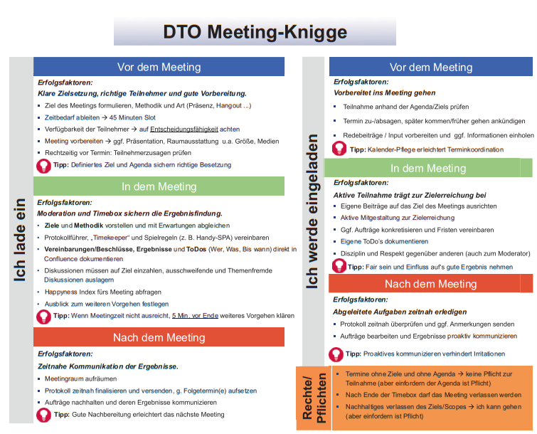

class: center, middle

## [Software Projektmanagement](index.html)

#### Kapitel 21

---

class: center, middle

## Die Gestaltung von Meetings und Workshops

---

## Worum geht es?

- Die Rolle des Moderators, der gleichzeitig Teilnehmer ist
- Die Werkzeuge mit denen der Moderator die Teilnehmer unterstützen kann
- Die verschiedenen Phasen der Moderation
- Die Vorbereitung, Durchführung und Nachbereitung von Meetings und Workshops
- Die Verhaltensregeln für eine gute Zusammenarbeit

---

class: center, middle

### Die Rollen

Moderator, Teilnehmer, Auftraggeber

---

### Der Moderator

Was macht der Moderator?

- Der Moderator ist für die Steuerung und Planung des Meetings verantwortlich
- Er hilft den Teilnehmer bei der Erreichung des Ziels
- Er sorgt für eine gute Atmosphäre
- Er sorgt für eine gute Struktur
- Er sorgt für eine gute Dokumentation

Die Teilnehmer sind für die Qualität der Ergebnisse verantwortlich

Aber der Moderator ihnen die richtigen Werkzeuge und Umgebung an die Hand geben

---

#### Doppelrolle Moderator und Teilnehmer

Der Moderator ist auch Teilnehmer

- Dabei sollte er auf einige Dinge achten

---

#### Werkzeuge des Moderators

Wie kann der Moderator die Teilnehmer unterstützen?

- Fragen stellen
- Visualisieren
- Paraphrasieren
- Zusammenfassen

Aber wie?

---

#### Fragen stellen

Wenn man Fragen stellt sollte man auf einige Dinge achten

Pakko-Fragen:

P|Persönlich|Du, Sie, Ihr...
---|---|---
A|Aktiv|Was denkst du über...
K|Kurz und knackig|Einfache Sätze
K|Konkret|Nach konkreten Apsekten fragen
O|Offen|Offene Fragen wie: wer, wann, was, warum, wie?

Gut Fragen stellen muss man üben!

---

#### Paraphrasieren

Der Moderator fasst das Gesagte in eigenen Worten zusammen

- Der Moderator zeigt damit, dass er zugehört hat
- Der Moderator kann Missverständnisse aufdecken
- Der Moderator kann die Diskussion auf ein Thema fokussieren
- Die Teilnehmer können genauere Aussagen machen

Beispiel:

- Aussage: Die Personas bringen gar nichts
- Paraphrase: Wenn ich dich richtig verstanden habe, dann siehst du für deine Anwendung keinen Mehrwert durch Personas.

---

#### Visualisieren

Mit Bildern kann man Sachverhalte besser darstellen

- Bilder helfen beim Verstehen
- Bilder helfen beim Erinnern
- Visualisieren erspart Notizen

Worauf muss der Moderator achten?

- Die Aufgaben und Fragen sollten vorher festgelegt sein
- Notieren der Ergebnisse
- Die Ergebnisse sollten für alle sichtbar sein
- Zugang zu Materialien und Flipcharts
- Visualisierungen speichern die Diskussion

Wie könnte eine Visualisierung aussehen?

---

#### Visualisierungsmöglicheiten

Es gibt viele Möglichkeiten etwas zu visualisieren und Informationen zu strukturieren

Für alle gilt:

- Es sollte einfach sein
- Die Visualisierung sollte für alle verständlich sein
- Gut lesbare Schrift
- Für alle sichtbar

Ein paar Beispiele:

Mindmap|Pinnwand|Flipchart|Flowchart|Ihsikawa Diagramm
---|---|---|---|---
||||

Ein weiterer Vorteil ist, dass eine Visualisierung einem das Protokoll ersparen kann

pinwand
https://magazin.weka-elearning.de/kanban

---

#### Zusammenfassen

Besonders nach längeren Diskussionen sollte der Moderator zusammenfassen

- Sichern von Ergebnissen und vom gemeinsamen Verständnis
- Zusammenfassug kann mit Visualisierung verbunden werden

---

### Moderationsphasen

- Man kann die Moderation in verschiedene Phasen einteilen

Ein mögliches Beispiel:

---

### Vorbereitung des Moderators

Die sieben P's

---

### Wie kann so eine Agenda aussehen?

- Timeboxing
  - Man gibt eine Zeit vor und die Arbeit passt sich an
  - Jeder Teilnehmer sollte die Zeit im Blick haben
  - Der Moderator soll die Teilnehmer auf die Zeit hinweisen
  - Ergebnisse müssen nicht perfekt sein

---

### Das Kennenlernen

Alternativen zum klassischen in der Reihe vorstellen:

- Alternative Reihenfolge (z.B. nach Geburtsdatum)
- Ball als Sprechobjekt
- Partnerinterview
- Steckbrief

---

### Die Arbeit mit Kleingruppen

Kleingruppenarbeit ist effektiver als die Arbeit in der Großgruppe

Ideen für die Gruppenbildung:

- Zufällig
- Abzählen
- Spielkarten
- Puzzleteile

Folgende Dinge sind klar zu regeln:

- Aufgabenstellung
- Zeit
- Ziel
- Ergebnisformat
- Rollenklärung
- Geplante Weiterverarbeitung
- Präsentation

---

### Abstimmungen

In Meetings und Workshops müssen oft Entscheidungen getroffen werden

Jeder Teilnehmer sollte eine gleiche Anzahl an Stimmen haben

Verschiedene Möglichkeiten:

- Handzeichen
- Flipchart mit Punkten
- Räumliche Abstimmung
- Skala

---

## Verhaltensregeln

Regeln sind elemar für eine gute Zusammenarbeit

Regeln sollten vorher festgelegt werden und visualisiert werden

---

