class: center, middle

## [Software Projektmanagement](index.html)

#### Kapitel 22


# Projektmanagement mit GitHub

Bjarne Zaremba  

---
# Allgemeine Informationen

### Issues

- Texteinträge, die zur Beschreibung von Fehlern im Code, Bugs und Aufgaben genutzt werden
- können genutzt werden, um Projekte mit der Scrum-Methode zu managen
- Aufbau eines Issues:
    - Markdown
    - Assignees
    - Labels
- Mehrere Möglichkeiten Issues auf GitHub zu erstellen:
    - Aus dem Repository über den "Issues"-Reiter
    - CLI: ```gh issue create --title "My new issue" --body "Here are more details."```
    - Aus einem Code-Review heraus

---
### Projects
- Kanban-Boards, in denen Issues dargestellt werden 
- Übersicht über den Status aller Aufgaben

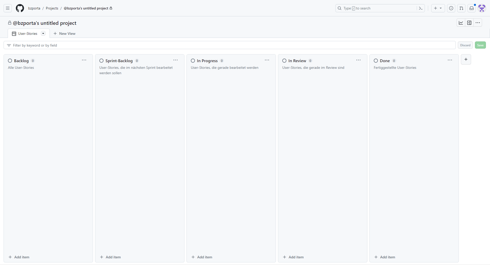
---

### Meilensteine
- Gruppen von Issues, die nach einer gemeinsamen Deadline gruppiert sind
- Nützlich, um Aufgaben in Sprints zu bearbeiten

### Issue-Linking
- Unterschiedliche Issues können miteinander verbunden werden 
- jeder Issue hat eine eigene Nummer
- \#... in die Beschreibung des Issues

### Pull-Request-Linking
- Pull-Requests können mit den dazugehörogen Issues verbunden werden
- \#... in die Beschreibung des Issues

---
class: center, middle

# Erstellen von Projekten und Issues auf GitHub
---
Startseite des Repositorys -> Auf Projects-Seite wechseln

<br>

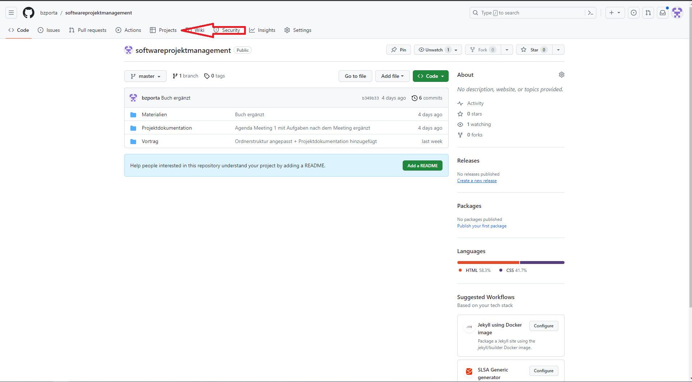
---
Neues Projekt erstellen

<br>

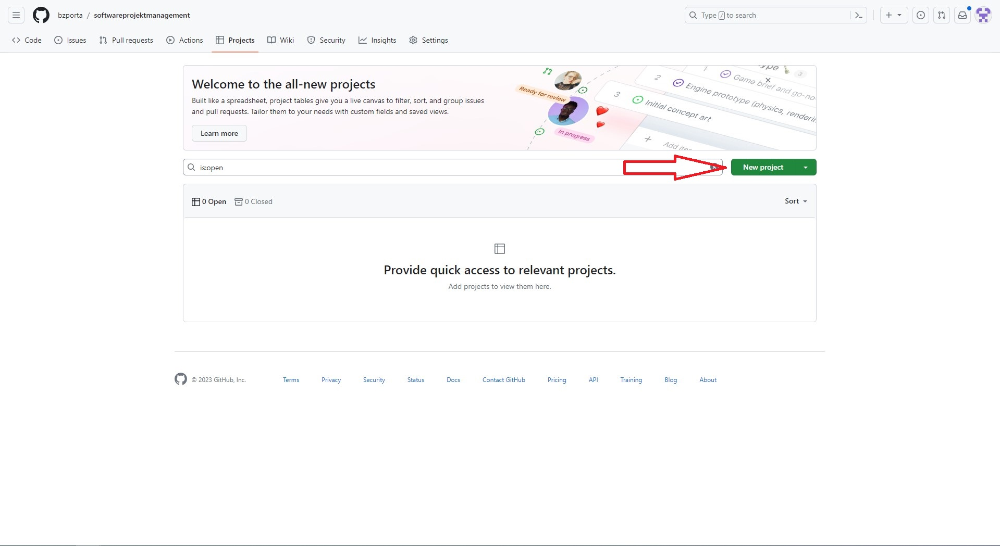
---
Menupunkt "Board" auswählen, Name vergeben und erstellen

<br>

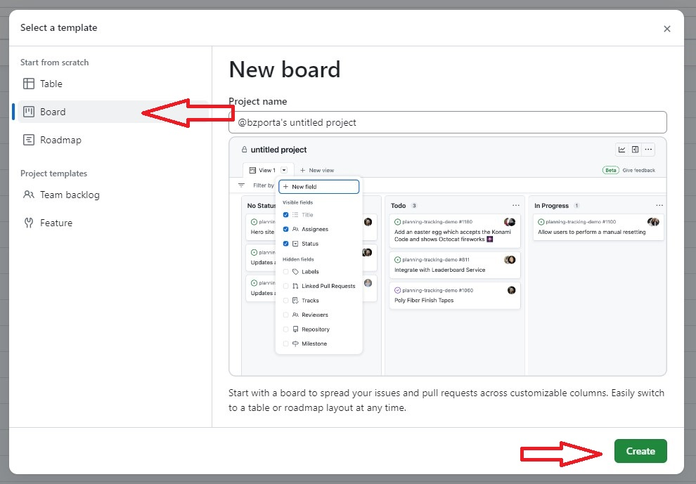
---

- Im Board sollen Hauptbestandteile der Scrum-Methode realisiert werden
- Folgende Spalten werden hinzugefügt:
    - Backlog
    - Sprint-Backlog
    - In Progress
    - In Review
    - Done


---

- Karten können nun erstellt werden und im Board von Links nach Rechts wandern
- Praktisch: Automatisiertes Erstellen von Karten 
- Neuer Issue erstellt -> Automatisches Hinzufügen einer Karte in der Backlog-Spalte
- Schließen eines Issues -> Automatisches Verschieben der Karte in die Done-Spalte

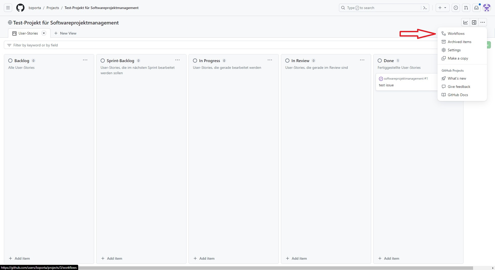

---

 VORSICHT: In der GitHub Dokumentation ist ein anderer, nicht mehr aktueller Ablauf beschrieben!

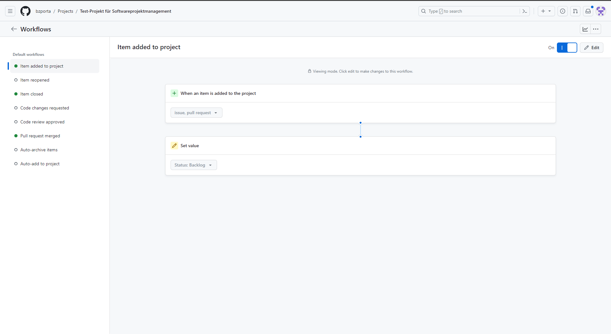


---
### Label erstellen
- Label werden zur Kennzeichnung und Suche von Issues genutzt
- Im Beispiel sollen 3 Label hintugefügt werden: Epics, User-Stories, Tasks
- Label werden beim Erstellen eines Issues zugeordnet

1. Startseite des Repositorys -> Reiter "Issues" auswählen
2. Rechts neben der Suchleiste auf "Labels" klicken
3. Neue Labels "Epics", "User-Stories" und "Tasks" hinzufügen

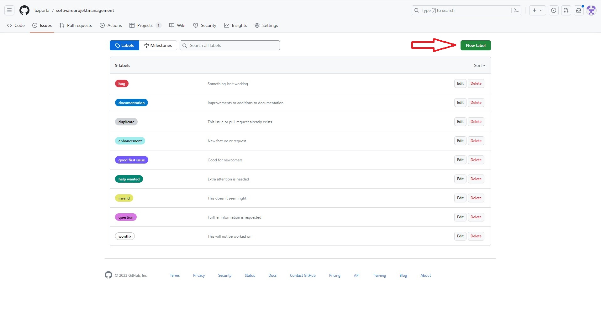
---
### Meilensteine erstellen
- Gruppieren Issues -> Nützlich für Sprints

1. Startseite des Repositorys -> Reiter "Issues" auswählen
2. Rechts neben der Suchleiste auf "Milestones"
3. "Create Milestone" -> Name und Fälligkeit auswählen
4. Zuweisen von Issues

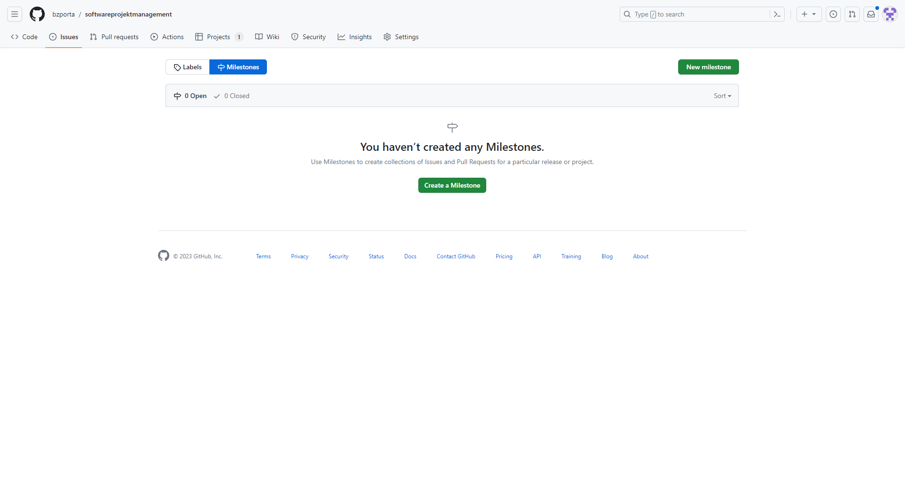
---
### Erstellen von Issue-Templates
- Erstellen von Issue-Templates, damit nicht jedesmal die Struktur eines Issues konfiguriert werden muss
- Wir erstellen ein Task-, User-Story- und Epic-Issue-Template (Auch diese Schritte sind anders als in der GitHub-Doku beschrieben!)

1. Auf der Startseite des Repositorys auf Einstellungen
2. Menupunkt "General" findet sich weiter unten der Punkt "Features"
3. Erstellen eines "Custom Templates" 
---
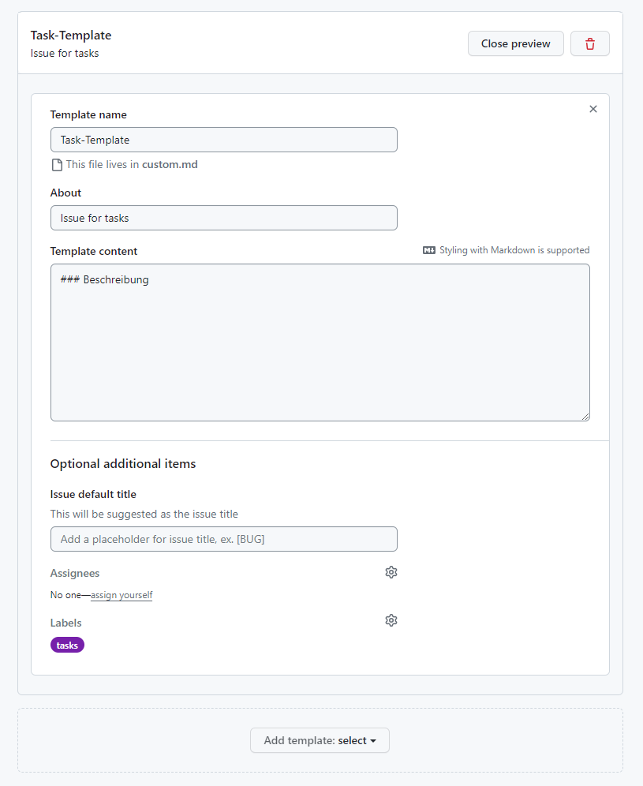
---

## Erstellen von Epics, User-Stories und Tasks
- Workspace jetzt fertig eingerichtet
- Um ein Softwareprojekt zu managen, müssen jetzt User-Stories, Epics und Tasks erstellt werden, dazu:

1. Auf der Startseite des Repositorys auf "Issues" -> Auswahl eines Issue-Templates

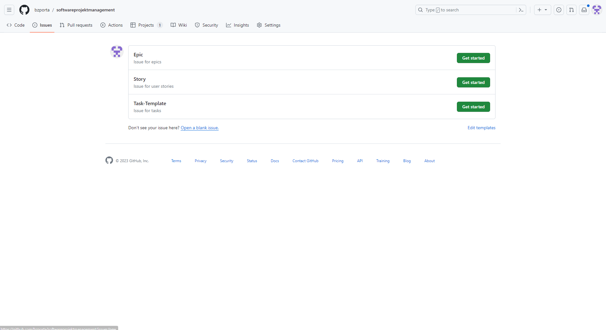
---
### Erstellen eines Epics
- Nur Titel und Beschreibung, aber keine Zuordnung zu Personen oder Projekten

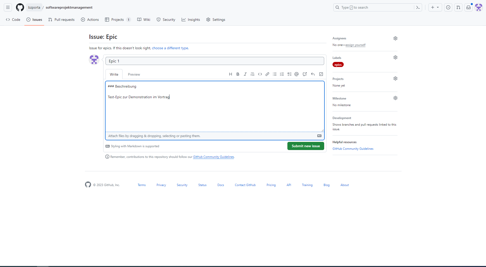
---
### Erstellen einer User-Story
- Titel, Link zum dazugehörigen Epic (#...), Beschreibung inkl. Aufgaben, Zuordnung zu Personen und zum Projekt

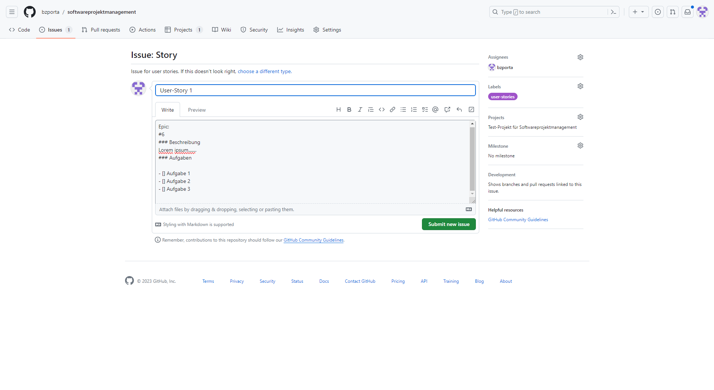
---
### Erstellen einer Task
- Titel, Link zur dazugehörigen User-Story (#...), Beschreibung der Aufgabe, Zuordnung zu Personen und Projekt

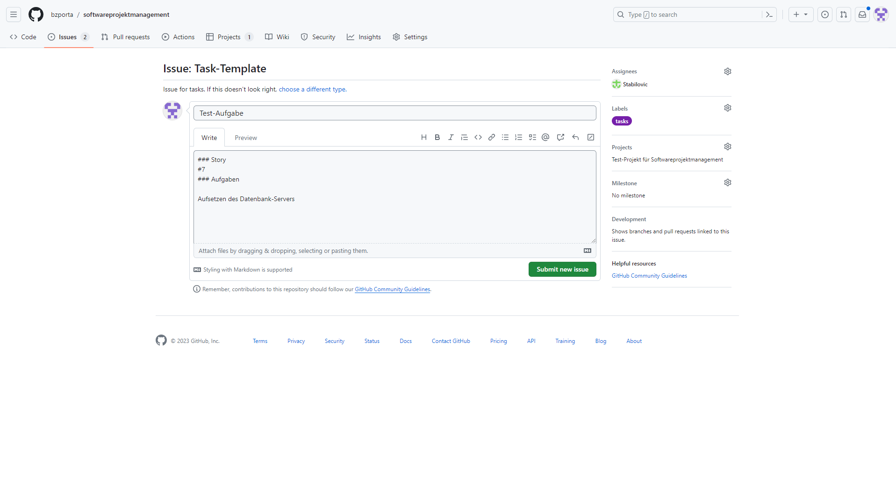
---
Durch die eingerichtetet Automatisierung, erscheinen die Issues jetzt auch im Kanban-Board:

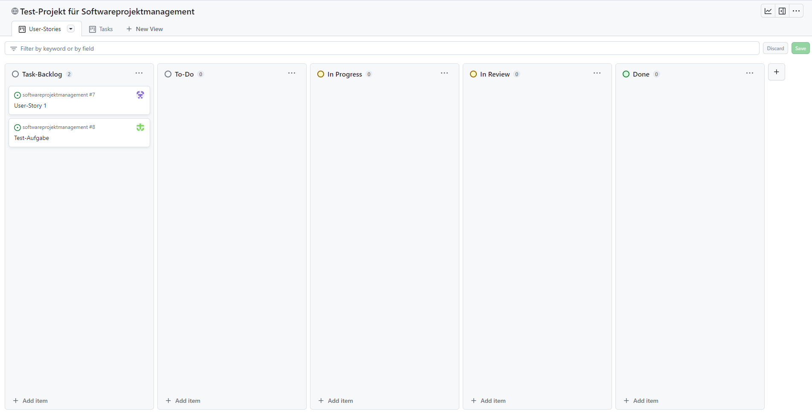
---
### Tutorial: Projekt nach Scrum-Methode einrichten
1. Projekt erstellen: mit Boards für User-Stories und Aufgaben
2. Automatisierung für Backlog und Done-Spalten einrichten
3. Labels für Epics, User-Stories und Tasks erstellen
4. Meilensteine für Sprints definieren
5. Erstelle Issue-Templates für konsistente Erfassung
6. Erstelle Epics, User-Stories und Tasks im Projekt-Board
---
## Zusammenfassung
- GitHub kann uns helfen, unsere Softwareprojekte zu managen, ohne die eigentlich Plattform dabei zu verlassen
- Issues sind vielseitige Einträge zur Fehlerverfolgung, Aufgaben und Funktionen
- Projekte ermöglichen die Visualisierung und Verwaltung von Aufgaben und User-Stories
- Meilensteine gruppieren Aufgaben für Sprints oder Ziele
- Verknüpfung von Pull-Requests und Issues verbessert das Verständnis des Entwicklungsfortschrittes
- Link zum Test-Repo: https://www.github.com/bzporta/softwareprojektmanagement_test
---
class: center, middle

# Fragen?

---

# Quellen

pinwand-Bild
https://magazin.weka-elearning.de/kanban
